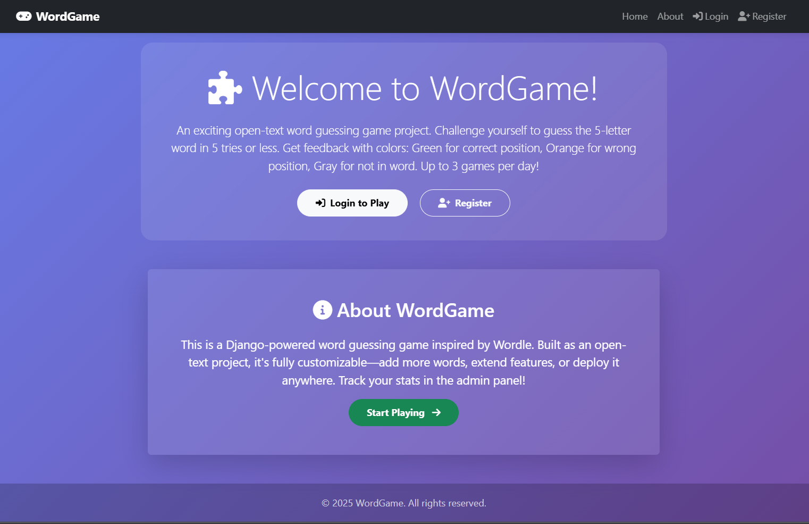

# Wordgame-Guess-The-Word

📖 Project Overview
WordGame is an interactive word guessing game inspired by Wordle, built with Django.
Players can log in, guess secret words, and receive real-time feedback with a fun UI.
It also includes an Admin Dashboard for monitoring reports and managing users.

✨ Key Features

User Registration & Login with validation:

Username: min 5 characters, must include upper & lower case.
Password: min 5 characters, must include letters, digits, and special chars ($, %, *, @).
Daily Limit: Max 3 games per user per day.

Gameplay:
Secret 5-letter word randomly chosen from 20 seeded words.
5 attempts allowed with color-coded feedback:
🟩 Green: correct position
🟧 Orange: wrong position
⬜ Gray: not in the word
Hint button reveals one random letter.

Game Persistence:
Saves guesses, results, and dates.
Admin Features:

Reports: daily stats & per-user history.

Django Admin integration.

Public Landing Page with navbar, About section, and login/register options.

🛠️ Tech Stack
Backend
Django 5.2.6 (Python 3.13.1)
Used for user authentication (django.contrib.auth), models (Game, Word), views, and URL routing.
Django ORM with SQLite for data management.

Frontend
HTML5, CSS3, JavaScript
Templates for dynamic pages (e.g., game.html).
Bootstrap 5
Provides responsive design for navbar, cards, and tables.
Font Awesome 6
Adds icons (e.g., chart, user) for visual appeal.

Database
SQLite
Default local database for simplicity; stores users, words, and game data.
Other Tools
Git + GitHub
Version control for code management and collaboration.

Python random library
Used for selecting secret words and hint letters.

🚀 Setup Instructions
Clone and run the project locally:
1. Clone Repo
   git clone https://github.com/Punith-b2004/Wordgame-Guess-The-Word.git
   cd Wordgame-Guess-The-Word

2. Set Up Virtual Environment

  Create a virtual environment:
    python -m venv myenv
  Activate it:
  Windows: myenv\Scripts\activate

  Install dependencies: pip install django

3. Apply Migrations and Seed Data

Run migrations to set up the database:
python manage.py makemigrations
python manage.py migrate
Create a superuser (admin): python manage.py createsuperuser
Enter username (e.g., admin), email, and password (e.g., Admin123$).

Seed 20 words into the database:
python manage.py shell

In the shell:
  from game.models import Word
words = ['APPLE', 'BREAD', 'CHAIR', 'DREAM', 'EAGLE', 'FLAME', 'GRAPE', 'HOUSE', 'IGLOO', 'JELLY', 'KIWIS', 'LEMON', 'MANGO', 'NIGHT', 'OCEAN', 'PEACH', 'QUEEN', 'RIVER', 'STONE', 'TIGER']
for w in words:
    Word.objects.get_or_create(word=w)
exit()

4. Run the Server

Start the development server:
  python manage.py runserver
  Open your browser and visit: http://127.0.0.1:8000/.

🎮 How the Project Works

Landing Page: Visit / to see a public page with a navbar (Home, About, Login, Register). Guests are prompted to log in.
Registration/Login:
Register at /register/ with validated credentials.
Log in at /login/ (User tab redirects to /game/, Admin to /admin/).

Gameplay: At /game/:
Start a new game with a random word.
Submit guesses (5 max) with color feedback.
Use hints or stop after win/lose.
Limited to 3 games/day.

Admin Dashboard: Access /admin/ or custom reports at /daily-report/ and /user-report/.
Logout: Returns to the public landing page.

✅ Testing Guide
1. Test User Registration and Login
Objective: Verify username/password constraints and login redirection.
Steps:

Register a New User:
Visit http://127.0.0.1:8000/register/.
Enter:
Username: testuser (5+ letters, e.g., testuser123).
Password: Test123$ (5+ chars, alpha, numeric, special: $, %, *, @).
Confirm Password: Match.
Submit. Expect redirection to / with "Welcome, testuser!" in navbar.
Test Failure: Try test (4 letters) or test123 (no special char)—expect validation errors.

Login as User:
Go to http://127.0.0.1:8000/login/, select "User Login" tab.
Enter punith and Pun123$ith (or testuser and Test123$).
Expect redirection to / with "Play Game" button.

Login as Admin:
Select "Admin Login" tab, use admin and Admin123$.
Expect redirection to /admin/.

2. Test Gameplay
Objective: Validate 5 guesses, color feedback, win/lose, and daily limit.
Steps:
Start Game:
Log in as punith, click "Play Game" or go to /game/.
Expect a 5x5 grid, input field, and "Guess" button.

Make Guesses:
Enter "EAGLE" (uppercase, 5 letters), click "Guess".
Check grid feedback (e.g., Gray, Orange, Gray, Gray, Gray based on secret).
Repeat with "APPLE" (Orange, Gray, Gray, Gray, Gray).
Try invalid inputs: "egg" (4 letters), "12345" (not alpha)—expect error alert.
Guess until win (all green) or 5th guess (lose). Expect alert ("Congratulations!" or "Better luck next time") and form hiding.

Daily Limit:
Start 3 games (via /game/ each time).
On the 4th attempt, expect "You have reached the daily limit of 3 games."
Wait until tomorrow (~5:30 AM IST) or reset db.sqlite3 for testing.

Hint Feature:
After a guess, click "Hint" button.
Expect a hint (e.g., "The secret word contains 'R'") or error if no letters left.
Fix 500 error if it occurs (ensure random is imported in views.py).

3. Test Admin Reports
Objective: Verify daily and user reports for superusers.
Steps:
Log In as Admin:
Use admin and Admin123$ via "Admin Login" tab.

Daily Report:
Visit http://127.0.0.1:8000/daily-report/?date=2025-09-26.
Expect a page showing "Number of Users" and "Number of Correct Guesses" (e.g., 1 user, 0 correct if no wins).
Play a game as punith and win to update the count.

User Report:
Visit http://127.0.0.1:8000/user-report/?username=punith.
Expect a table of dates with "Words Tried" and "Correct Guesses" (e.g., 1 tried, 0 correct).
Add more games to see multiple entries.

Navbar Access:
Confirm "Daily Report" and "User Report" appear in the navbar for admin.

4. Test Data Persistence
Objective: Ensure guesses and game data are saved.
Steps:

After a game, go to /admin/game/game/ (as admin).
Check for a Game entry with user=punith, secret_word (hidden), guesses (list of attempts), won (True/False), and date (today).
Verify multiple games show distinct entries.

5. Edge Cases and Cleanup
Objective: Test invalid scenarios and system robustness.
Steps:

Invalid Registration: Try username test (4 letters) or password test123 (no special)—expect validation errors.
Invalid Guess: Enter 12345 or egg — expect "Invalid guess" alert.
Daily Limit Edge: Start 3 games, attempt 4th — expect limit message.
Hint on New Game: Click "Hint" without guessing — expect "No hints left" if applicable.
Logout: Log out from navbar — expect public home page.
Cleanup: Delete db.sqlite3, re-run python manage.py migrate, and seed words.

Author:Punith B
Linkedin:https://www.linkedin.com/in/punith-b-aa264b282
